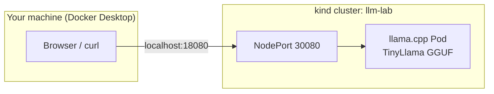

# LLM deploys on Kubernetes (kind + Docker Desktop)

Hands-on lab to deploy a small LLM on Kubernetes, expose it on your laptop, and run inference.

| Path | Stack | Time | Best for |
|------|-------|------|----------|
| **A (recommended)** | kind + llama.cpp | about 10 min | GGUF models, LoRA adapters, OpenAI API |
| **B (optional)** | kind + KServe | about 20 min | InferenceService CRD, HuggingFace runtime |

## Prerequisites

- Docker Desktop running (8 GB+ RAM recommended)
- `kind`, `kubectl`, `curl` in your PATH
- Bash (Git Bash or WSL on Windows)

```bash
# Install kind (if missing)
go install sigs.k8s.io/kind@latest
# or: choco install kind   # Windows
```

## Quick start (Path A: llama.cpp)

From the repo root:

```bash
chmod +x scripts/*.sh
./scripts/run-lab.sh
```

This will:

1. Create a kind cluster named `llm-lab`
2. Deploy TinyLlama 1.1B (GGUF, about 670 MB) via llama.cpp
3. Expose it at http://localhost:18080
4. Run a test chat completion

### Endpoints

| URL | Purpose |
|-----|---------|
| http://localhost:18080 | llama.cpp web UI and API |
| http://localhost:18080/health | Health check |
| http://localhost:18080/v1/chat/completions | OpenAI-compatible API |

### Use your own model or fine-tuned adapter

```bash
export MODEL_URL="https://huggingface.co/<user>/<repo>/resolve/main/your-model.Q4_K_M.gguf"
export LORA_URL="https://huggingface.co/<user>/<repo>/resolve/main/your-adapter.gguf"
./scripts/deploy-llamacpp.sh
```

The init container downloads into a PVC so restarts are fast.

## Path B: KServe (optional)

```bash
./scripts/setup-kind.sh
./scripts/install-kserve.sh
./scripts/deploy-kserve.sh
./scripts/test-kserve.sh
```

Predictor exposed at http://localhost:18081 (NodePort 30081).

## Architecture



## Troubleshooting

```bash
kubectl -n llm get pods
kubectl -n llm logs -f deploy/llamacpp -c fetch-model
kubectl -n llm logs -f deploy/llamacpp -c server

kubectl -n llm delete pvc model-cache --ignore-not-found
./scripts/deploy-llamacpp.sh
```

**Pod OOM or slow:** increase Docker Desktop memory to 8 GB+.

**Port in use:** change `hostPort` in `kind/cluster.yaml` and recreate the cluster.

## Lab walkthrough

Step-by-step teaching guide: [labs/01-minimal-llamacpp-kind/LAB.md](labs/01-minimal-llamacpp-kind/LAB.md)

## Cleanup

Remove the cluster and all lab resources in one step:

```bash
./scripts/cleanup.sh
```

This deletes the `llm-lab` kind cluster. All namespaces, pods, PVCs, and services inside it are removed with the cluster.
